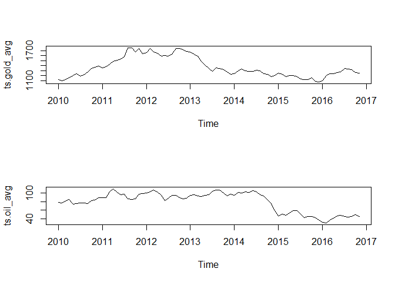
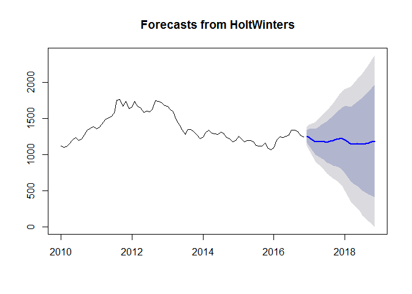
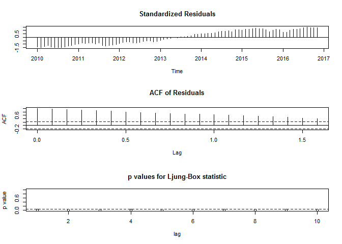

# homework 6


```r
setwd("C:\\Users\\Steven\\Google Drive\\1. MOT\\1) Fall 2016\\1. BA\\Assignments\\Homework 6")
 
sp <- read.csv("sp.csv", stringsAsFactors=FALSE, header=TRUE)
```


```r
sp$Date <- as.Date(sp$Date, "%d-%B-%y")
```


#sort by date, starting with the oldest dates

```r
sp <- sp[order(as.Date(sp$Date, format="%Y/%m/%d", decreasing=FALSE)),]
```


#sort in decreasing fashion using reverse function (decreasing=TRUE does not work for dates)


```r
sp_descending <- sp[rev(order(as.Date(sp$Date))),]
```


#read in gold 

```r
gold <- read.csv("gold2016.csv", stringsAsFactors=FALSE, header=TRUE)
gold$Date <- as.Date(gold$Date, "%d-%B-%y")
gold <- gold[order(as.Date(gold$Date, format="%y/%m/%d")),]
```


#create monthly intervals by just third day 


```r
gold['day']<- strftime(gold$Date, "%d")
```

#create snapshot monthly price of Gold on third of month 

```r
gold_month <- subset(gold, gold$day == "03")
gold_month['gold_month_price'] <- gold_month$Price
gold_month <- subset(gold_month, select=c("gold_month_price"))
```


#calculate average monthly price of Gold 

```r
gold['day_year'] <- strftime(gold$Date, "%m/%y")
gold['avg_price'] <- 0
for (i in 1:nrow(gold)) {
  submonth <- subset(gold, day_year == day_year[i])
  gold$avg_price[i] <- (sum(submonth$Price))/length(submonth$Price)
}
```


#create training and test data for to gague forecast accuracy 

```r
gold_train <- subset(gold, Date > as.Date("2016-01-01"))
gold_test <- subset(gold, Date < as.Date("2016-01-01"))
```


#read in oil

```r
oil <- read.csv("oil2016.csv", stringsAsFactors=FALSE, header=TRUE)
oil$Date <- as.Date(oil$Date, "%d-%B-%y")
oil <- oil[order(as.Date(oil$Date, format="%y/%m/%d")),]
```


#oil monthly 

```r
oil['day_year'] <- strftime(oil$Date, "%m/%y")
oil['avg_price'] <- 0
for (i in 1:nrow(oil)) {
  submonth <- subset(oil, day_year == day_year[i])
  oil$avg_price[i] <- (sum(submonth$Price))/length(submonth$Price)
}
```

#s&p500 monthly 

```r
sp['day_year'] <- strftime(sp$Date, "%m/%y")
sp['avg_price'] <- 0
for (i in 1:nrow(sp)) {
  submonth <- subset(sp, day_year == day_year[i])
  sp$avg_price[i] <- (sum(submonth$Price))/length(submonth$Price)
}
```


#create test/train data for oil 

```r
oil_train <- subset(oil, Date > as.Date("2016-01-01") )
oil_test <- subset(oil, Date < as.Date("2016-01-01"))
```


#merge

```r
oil['oil'] <- oil$Price 
sp['sp'] <- sp$Price
gold['gold'] <- gold$Price
gold['gold_avg'] <-gold$avg_price

timeseries <- merge(oil, sp, by="Date")
timeseries <- merge(timeseries, gold, by="Date")
timeseries <- subset(timeseries, select=c("Date", "oil", "sp", "gold", "gold_avg"))
```


#unique TS for monthly values  

```r
timeseries_month <- unique(timeseries$gold_avg, incomparables=FALSE)

timeseries_month_oil <- unique(oil$avg_price, incomparables=FALSE)

timeseries_month_sp <- unique(sp$avg_price, incomparables=FALSE)
```


#Create time series

```r
timeseries_all <- subset(timeseries, select=c("oil", "sp", "gold"))
ts.all <- ts(data=timeseries_all)

ts.oil<-ts(timeseries_all$oil, start=c(2010))
ts.oil_avg <- ts(timeseries_month_oil, start=c(2010), frequency=12)

ts.gold <- ts(timeseries_all$gold, start=c(2010), frequency=5)
```


#Gold Time Series (Daily)

<!-- -->


```r
ts.gold_avg <- ts(timeseries_month, start=c(2010), frequency=12)

ts.sp <- ts(timeseries_all$sp)
ts.sp_avg <- ts(timeseries_month_sp,  start=c(2010), frequency=12 )
```


#combine oil and gold monthly 


```r
ts.combo <- cbind(ts.oil_avg, ts.gold_avg)
```

<!-- -->
#Oil and Gold Monthly Correlation  
<!-- -->


```r
 decompose 
```

```
## function (x, type = c("additive", "multiplicative"), filter = NULL) 
## {
##     type <- match.arg(type)
##     l <- length(x)
##     f <- frequency(x)
##     if (f <= 1 || length(na.omit(x)) < 2 * f) 
##         stop("time series has no or less than 2 periods")
##     if (is.null(filter)) 
##         filter <- if (!f%%2) 
##             c(0.5, rep_len(1, f - 1), 0.5)/f
##         else rep_len(1, f)/f
##     trend <- filter(x, filter)
##     season <- if (type == "additive") 
##         x - trend
##     else x/trend
##     periods <- l%/%f
##     index <- seq.int(1L, l, by = f) - 1L
##     figure <- numeric(f)
##     for (i in 1L:f) figure[i] <- mean(season[index + i], na.rm = TRUE)
##     figure <- if (type == "additive") 
##         figure - mean(figure)
##     else figure/mean(figure)
##     seasonal <- ts(rep(figure, periods + 1)[seq_len(l)], start = start(x), 
##         frequency = f)
##     structure(list(x = x, seasonal = seasonal, trend = trend, 
##         random = if (type == "additive") x - seasonal - trend else x/seasonal/trend, 
##         figure = figure, type = type), class = "decomposed.ts")
## }
## <bytecode: 0x0000000012315b08>
## <environment: namespace:stats>
```

```r
ts.gold_avg.d <- decompose(ts.gold_avg)
```

#Gold Monthly Average Time Series - Decomposed 

<!-- -->


```r
ts.oil_avg.d <- decompose(ts.oil_avg)
```

#Oil Monthly Average Time Series - Decomposed 

<!-- --><!-- -->


```r
ts.gold.1.d <- decompose(ts.gold_avg)
```

#Gold Monthly Average Time Series 

<!-- -->


```r
ts.sp_avg.d <- decompose(ts.sp_avg)
```

#SP 500 Monthly Average Time Series 

<!-- -->


#Gold forecast with HoltWinters 


```r
library(forecast)
```

```
## Warning: package 'forecast' was built under R version 3.3.2
```

```
## Loading required package: zoo
```

```
## Warning: package 'zoo' was built under R version 3.3.2
```

```
## 
## Attaching package: 'zoo'
```

```
## The following objects are masked from 'package:base':
## 
##     as.Date, as.Date.numeric
```

```
## Loading required package: timeDate
```

```
## Warning: package 'timeDate' was built under R version 3.3.2
```

```
## This is forecast 7.3
```

```
## 
## Attaching package: 'forecast'
```

```
## The following object is masked _by_ '.GlobalEnv':
## 
##     gold
```

```r
gold.holt <- HoltWinters(ts.gold_avg, gamma=FALSE)

gold.holt_fore <- forecast.HoltWinters(gold.holt, h=12)
```

#Gold Forecast (Holt Winters)

<!-- --><!-- -->


#Oil Forecast (Holt Winters)


```r
oil.holt <- HoltWinters(ts.oil_avg, gamma=FALSE)
oil.holt_fore <- forecast.HoltWinters(oil.holt, h=12)
```

#Oil Forecast (Holt Winters)

<!-- --><!-- -->

#S&P Forecast (Holt Winters)


```r
sp.holt <- HoltWinters(ts.sp_avg, gamma=FALSE)
sp.holt_fore <- forecast.HoltWinters(sp.holt, h=12)
```

#S&P Forecast (Holt Winters)

<!-- --><!-- -->
 

#gold seasonal (HoltWinters forecast)


```r
gold.holt.seasonal <- HoltWinters(ts.gold_avg, gamma=TRUE)
gold.holt.seasonal <- forecast.HoltWinters(gold.holt.seasonal, h=12)
```
<!-- -->

#oil seasonal (HoltWinters forecast)


```r
oil.holt.seasonal <- HoltWinters(ts.gold_avg, gamma=TRUE)
oil.holt.seasonal.fore <- forecast.HoltWinters(oil.holt.seasonal)

sp.holt.seasonal <- HoltWinters(ts.sp_avg, gamma=TRUE)
sp.holt.seasonal.fore <- forecast.HoltWinters(sp.holt.seasonal)
```
<!-- --><!-- -->

#test data for stationarity 


```r
require(tseries)
```

```
## Loading required package: tseries
```

```
## Warning: package 'tseries' was built under R version 3.3.2
```

```r
adf.test(diff(diff(log(ts.gold_avg))))
```

```
## Warning in adf.test(diff(diff(log(ts.gold_avg)))): p-value smaller than
## printed p-value
```

```
## 
## 	Augmented Dickey-Fuller Test
## 
## data:  diff(diff(log(ts.gold_avg)))
## Dickey-Fuller = -6.7694, Lag order = 4, p-value = 0.01
## alternative hypothesis: stationary
```

```r
adf.test(diff(diff(log(ts.oil_avg))))
```

```
## Warning in adf.test(diff(diff(log(ts.oil_avg)))): p-value smaller than
## printed p-value
```

```
## 
## 	Augmented Dickey-Fuller Test
## 
## data:  diff(diff(log(ts.oil_avg)))
## Dickey-Fuller = -6.1816, Lag order = 4, p-value = 0.01
## alternative hypothesis: stationary
```

```r
adf.test(diff(diff(log(ts.oil))))
```

```
## Warning in adf.test(diff(diff(log(ts.oil)))): p-value smaller than printed
## p-value
```

```
## 
## 	Augmented Dickey-Fuller Test
## 
## data:  diff(diff(log(ts.oil)))
## Dickey-Fuller = -19.843, Lag order = 12, p-value = 0.01
## alternative hypothesis: stationary
```

#create standard ARIMA model with no differencing to see what changes are neccesary


```r
library(forecast)  
library(stats)
 
fit_1<- arima(ts.gold_avg, c(0,0,0))
fit_2<- arima(ts.oil_avg, c(0,0,0))
fit_3 <- arima(ts.sp_avg, c(0,0,0))
```

#ARIMA model for Gold (no differencing)

<!-- -->

#ARIMA model for Oil (no differencing)

<!-- -->

#ARIMA model for S&P500 (no differencing)

<!-- -->


#get lazy and have R create fit for you 


```r
fit_gold<- auto.arima(ts.gold_avg)
fit_gold <- arima(ts.gold_avg, c(1, 1, 1))

fit_oil <- auto.arima(ts.oil_avg)


fit_oil <- arima(ts.oil_avg, c(0,1, 1))


fit_sp <- auto.arima(ts.sp_avg)
 

fit_sp <- arima(ts.sp_avg, c(0,1,0))
```


#gold ARIMA 

<!-- -->


#oil ARIMA 

<!-- -->

#sp ARIMA

<!-- -->


 


#create forecast 


```r
fit_gold <- forecast.Arima(fit_gold, h=12)
plot(fit_gold)
```

<!-- -->

```r
summary(fit_gold)
```

```
## 
## Forecast method: ARIMA(1,1,1)
## 
## Model Information:
## 
## Call:
## arima(x = ts.gold_avg, order = c(1, 1, 1))
## 
## Coefficients:
##           ar1     ma1
##       -0.6350  0.8694
## s.e.   0.2266  0.1602
## 
## sigma^2 estimated as 2340:  log likelihood = -434.58,  aic = 875.17
## 
## Error measures:
##                    ME     RMSE      MAE        MPE     MAPE      MASE
## Training set 1.455256 48.07998 37.48273 0.07363439 2.704427 0.2014294
##                    ACF1
## Training set 0.04472606
## 
## Forecasts:
##          Point Forecast    Lo 80    Hi 80     Lo 95    Hi 95
## Dec 2016       1256.590 1194.599 1318.581 1161.7823 1351.397
## Jan 2017       1251.987 1153.505 1350.469 1101.3721 1402.602
## Feb 2017       1254.910 1135.631 1374.188 1072.4889 1437.331
## Mar 2017       1253.054 1113.129 1392.979 1039.0571 1467.051
## Apr 2017       1254.232 1098.027 1410.438 1015.3368 1493.128
## May 2017       1253.484 1081.569 1425.400  990.5622 1516.406
## Jun 2017       1253.959 1068.227 1439.692  969.9060 1538.012
## Jul 2017       1253.658 1054.728 1452.587  949.4210 1557.894
## Aug 2017       1253.849 1042.748 1464.950  930.9981 1576.700
## Sep 2017       1253.727 1030.997 1476.457  913.0914 1594.364
## Oct 2017       1253.805 1020.097 1487.512  896.3803 1611.229
## Nov 2017       1253.756 1009.519 1497.992  880.2281 1627.283
```

